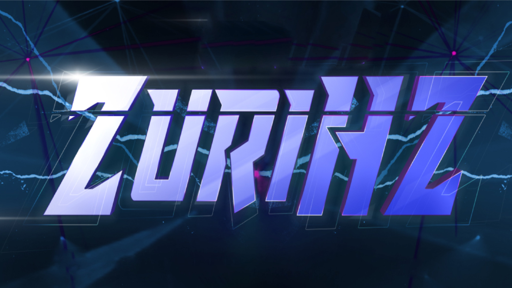

# 👋 Hola, soy ZURIHZ

## **Frontend & Full Stack Developer**

_Transformando ideas en experiencias digitales de alto rendimiento._

---

## 🚀 Sobre mí

Soy un desarrollador apasionado por el **ecosistema JavaScript**, especializado en crear aplicaciones web modernas, robustas y escalables. Me enfoco en escribir código limpio, mantenible y optimizado para el usuario final.

- 🔭 Actualmente trabajando en proyectos con **Next.js** y **Astro**.
- 🌱 Aprendiendo profundamente sobre **Inteligencia Artificial** y **Machine Learning**.
- ⚡ Comprometido con el rendimiento y la accesibilidad web.

---

## 🛠️ Mi Stack Tecnológico

### **Frontend Mastery**

### **Backend & Cloud**

---

## 🌟 Proyectos Destacados

| Proyecto                           | Descripción                                                                         |
| ---------------------------------- | ----------------------------------------------------------------------------------- |
| **SaaS de Entrevistas con IA**     | Plataforma que genera preguntas personalizadas con IA para preparar entrevistas.    |
| **Generador de Depósitos a Excel** | Aplicación Full-Stack para gestión financiera con Supabase y personalización UI/UX. |
| **Sistema de Autenticación**       | Sistema completo de autenticación con Firebase, roles y gestión en tiempo real.     |

---

## 📊 GitHub Analytics

 

---

## 📧 Hablemos

¿Tienes una idea en mente o buscas colaborar en algo increíble? ¡No dudes en contactarme!

- 📩 **Email:** [hassamzuriellg@gmail.com](mailto:hassamzuriellg@gmail.com)
- 💼 **LinkedIn:** [Hassam Lagos](https://www.linkedin.com/in/hassam-lg-b999983a2/)

_Gracias por visitar mi perfil. Si te gusta mi trabajo, ¡una ⭐ en mis repositorios sería genial!_

